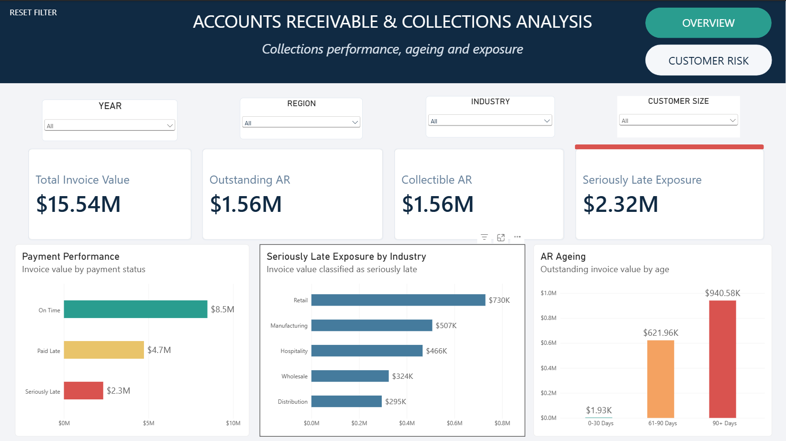

# Accounts Receivable & Collections Analytics

## Project Overview

Effective accounts receivable management is essential for maintaining healthy cash flow and ensuring that revenue generated from sales is successfully converted into cash collections.

However, businesses often face challenges in identifying overdue balances, understanding customer payment behaviour, and determining where collection efforts should be prioritised.

This project analyses Accounts Receivable (AR) data to evaluate invoice performance, payment behaviour, receivables ageing, and customer exposure.

The goal was to transform raw financial transaction data into meaningful insights that could help finance teams:

- Monitor outstanding receivables
- Identify collection risks
- Understand customer payment patterns
- Improve collection prioritisation

The project follows an end-to-end analytics workflow:

**Excel → MySQL → Power BI → Business Insights**

---

# Business Context

A company generates revenue by issuing invoices to customers, but revenue is only realised when customers complete payment.

Delayed payments can create cash flow challenges, increase collection effort, and expose the organisation to financial risk.

The finance team needed answers to key questions:

### Receivables Performance

- How much value has been invoiced?
- How much remains outstanding?
- What proportion of receivables require collection attention?

### Payment Behaviour

- How effectively are customers paying invoices?
- Which invoices are paid late?
- Where are payment delays concentrated?

### Collection Risk

- Which outstanding balances represent the highest risk?
- How old are unpaid invoices?
- Which customers contribute the greatest exposure?

---

# Dataset Overview

The dataset represents a simulated Accounts Receivable environment containing invoice transactions and customer information.

The dataset consists of two related tables:

## Invoice Table

The Invoice table represents transactional billing activity.

Each row represents an individual invoice issued to a customer.

The table contains information required to analyse:

- Invoice value
- Payment status
- Payment timing
- Outstanding balances
- Receivables ageing

Key fields include:

| Field | Description |
|---|---|
| Invoice_ID | Unique identifier for each invoice |
| Customer_ID | Identifier linking invoices to customers |
| Invoice_Date | Date invoice was issued |
| Due_Date | Date payment was expected |
| Paid_Date | Date payment was received |
| Invoice_Value | Monetary value of invoice |
| Payment_Status | Payment classification |
| Days_Late | Number of days payment exceeded due date |

---

## Customer Table

The Customer table contains customer-level attributes used to analyse receivables exposure.

It enables analysis across:

- Customer segments
- Industries
- Regions

Key fields include:

| Field | Description |
|---|---|
| Customer_ID | Unique identifier for each customer |
| Industry | Customer industry classification |
| Customer_Size | Customer segment |
| Region | Customer location grouping |

---

# Data Preparation & Validation

Before analysis, the dataset was reviewed to ensure accuracy and reliability.

The validation process included:

## Missing Value Analysis

Missing values were investigated across important financial fields.

Checks were performed on:

- Paid_Date
- Days_Late
- Customer information
- Transaction fields

### Days Late Handling

The Days_Late field was reviewed to determine whether blank values represented data quality issues or valid missing calculations.

Blank Days_Late values were associated with records where payment completion information was unavailable, meaning payment delay could not be calculated.

These values were not replaced with zero because doing so would incorrectly classify unpaid invoices as on-time payments.

The records were retained as unavailable for late-payment calculation to preserve analytical accuracy.

---

## Duplicate Checks

Duplicate checks were performed to ensure:

- Each invoice represented a unique transaction
- Customer records maintained consistency
- Financial calculations were not affected by repeated records

---

## Data Consistency Checks

The dataset was reviewed for:

- Valid invoice and payment dates
- Correct customer relationships
- Consistent payment status classification
- Reliable calculations for receivables analysis

---

# Analytical Approach

## Excel Analysis

Excel was used as the initial analysis environment to:

- Explore the dataset structure
- Perform validation checks
- Review financial fields
- Prepare analytical calculations

---

## SQL Analysis

The dataset was imported into MySQL for structured analysis.

SQL was used to:

- Create relational tables
- Validate imported data
- Analyse invoice performance
- Calculate receivables metrics
- Evaluate customer exposure

---

## Power BI Dashboard

Power BI was used to transform analytical outputs into interactive financial reporting.

The dashboard provides visibility into:

- Overall receivables position
- Outstanding balances
- Payment performance
- AR ageing risk
- Customer exposure patterns

---

# Key Findings

## Receivables Position

The analysis reviewed a total invoice value of:

**$15.54M**

The analysis identified:

**$1.56M in outstanding receivables**

This represents invoice value requiring monitoring and collection attention.

---

## Collection Risk

Receivables ageing analysis was used to identify balances that remained unpaid for extended periods.

The analysis identified:

**$2.32M in seriously late exposure**

Older outstanding balances represent increased collection risk and require prioritised review.

---

## Customer Exposure

Customer-level analysis showed that receivables exposure was concentrated among certain customers and segments.

This highlights the importance of monitoring high-value outstanding accounts and understanding customer payment behaviour.

---

# Business Recommendations

Based on the analysis:

## Prioritise Collection Activities

Finance teams should focus collection efforts on:

- Older ageing categories
- High-value outstanding invoices
- Customers with repeated payment delays

---

## Monitor High-Risk Customers

Regular review should be performed for customers with:

- Large outstanding balances
- Significant overdue exposure
- Consistent late payment patterns

---

## Improve Receivables Reporting

A recurring reporting process can help finance teams monitor:

- Outstanding balances
- Ageing movement
- Collection progress
- Customer payment trends

---

# Tools & Skills Demonstrated

## Excel

- Data validation
- Financial analysis
- Formula-based calculations
- Exploratory analysis

## SQL / MySQL

- Database creation
- Data validation
- Query development
- Aggregations
- Joins
- Financial analysis

## Power BI

- Data modelling
- KPI development
- Dashboard creation
- Interactive reporting
- Business storytelling

---

# Repository Structure

├── dataset
├── excel
├── sql
├── powerbi
├── screenshots
├── insights
└── README.md

---

# Project Limitations

- The dataset represents a simulated business environment.
- External factors affecting payment behaviour, such as customer disputes or economic conditions, were not included.
- Analysis was based on available invoice and customer attributes.

---

# Author

**Aderonke Ojedokun**

Accounting Graduate | Finance Analytics Portfolio

Skills:
Excel | MySQL | Power BI | Financial Analysis
